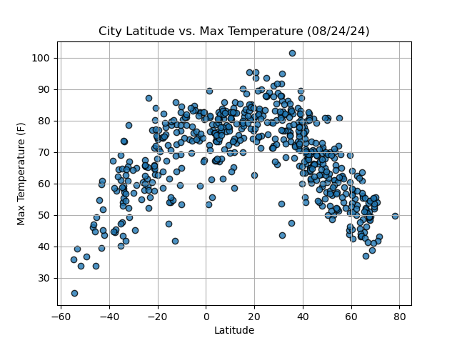
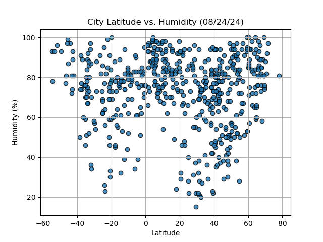
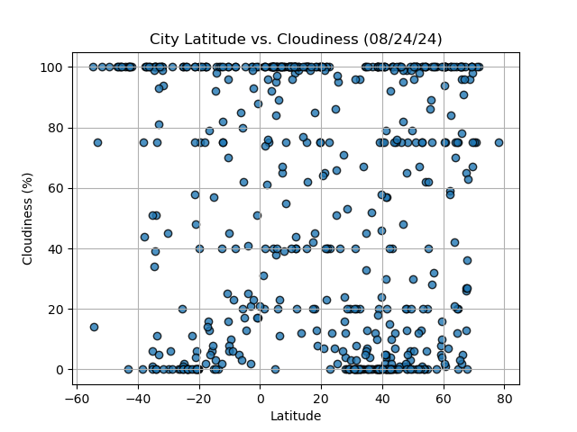

# python-api-challenge

##### Requirement 1: Create Plots to Showcase the Relationship Between Weather Variables and Latitude

Using the OpenWeatherMap API, I was able to retrieve weather data from the cities list generated in the starter code and I created a series of scatter plots to showcase the following relationships:

* Latitude vs. Temperature
* 

* Latitude vs. Humidity
* 

* Latitude vs. Cloudiness
* 

* Latitude vs. Wind Speed
* 

##### Requirement 2: Compute Linear Regression for Each Relationship

Compute the linear regression for each relationship. Separate the plots into Northern Hemisphere (greater than or equal to 0 degrees latitude) and Southern Hemisphere (less than 0 degrees latitude). Define a function in order to create the linear regression plots.

Next, create a series of scatter plots. Include the linear regression line, the model's formula, and the r^2 values

After each pair of plots, explain what the linear regression is modeling. Describe any relationships that you notice and any other findings you may uncover.

Create the following plots:

* Northern Hemisphere: Temperature vs. Latitude
* 

* Southern Hemisphere: Temperature vs. Latitude
* 

**Discussion about the linear relationship:** The temperature increases as we approach the equator (Latitude 0) and decreases as we move away from the equator.
The r-squared values is closer to 1 which indicates that the model explains a large portion of the variance in the dependent variable. This generally suggests a good fit.

* Northern Hemisphere: Humidity vs. Latitude
* 

* Southern Hemisphere: Humidity vs. Latitude
* 

**Discussion about the linear relationship:** 
* The data shows that the humidity is lower near the equator in the Southern hemisphere.
* The data shows that the humidity is higher near the equator in the Northern hemisphere.
* The r-squared values is very low suggesting that the model does not do a good job of explaining the variation in the data.

* Northern Hemisphere: Cloudiness vs. Latitude
* 

* Southern Hemisphere: Cloudiness vs. Latitude
* 

**Discussion about the linear relationship:** 
* The cloudiness is higher near the equator and decreases as we move away from the equator.
* The data shows that the cloudiness is higher near the equator and lower as we move away from the equator.
* The data shows that the cloudiness is higher near the equator in the Southern Hemisphere
* The data shows that the cloudiness is higher near the equator and lower as we move away from the equator in the Northern Hemisphere.
* The r-squared values is very low suggesting that the model does not do a good job of explaining the variation in the data.

* Northern Hemisphere: Wind Speed vs. Latitude
* 

* Southern Hemisphere: Wind Speed vs. Latitude
* 

**Discussion about the linear relationship:** 
* The data shows that the wind speed is higher near the equator and lower as we move away from the equator in the Northern Hemisphere.
* The data shows that the wind speed is lower near the equator in the Southern Hemisphere.
* The r-squared values is very low suggesting that the model does not do a good job of explaining the variation in the data.

#### Part 2: VacationPy

In this deliverable, I used my weather data skills to plan future vacations, using Jupyter notebooks, the geoViews Python library, and the Geoapify API.

The main tasks will be to use the Geoapify API and the geoViews Python library and employ my Python skills to create map visualizations.

1. Create a map that displays a point for every city in the `city_data_df` DataFrame. The size of the point should be the humidity in each city.

2. Narrow down the `city_data_df` DataFrame to find your ideal weather condition. For example:

    * A max temperature lower than 27 degrees but higher than 21

    * Wind speed less than 4.5 m/s

    * Zero cloudiness

3. Create a new DataFrame called `hotel_df` to store the city, country, coordinates, and humidity.

4. For each city, use the Geoapify API to find the first hotel located within 10,000 meters of your coordinates.

5. Add the hotel name and the country as additional information in the hover message for each city on the map
   